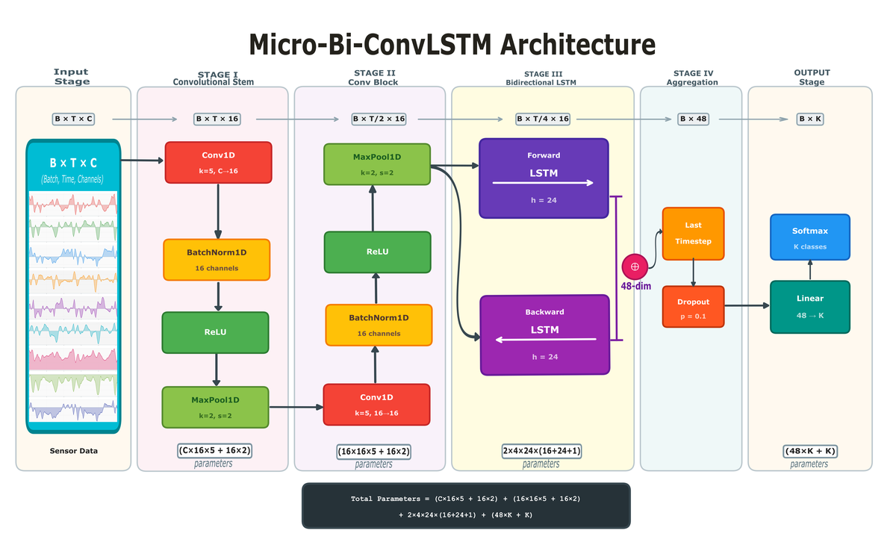
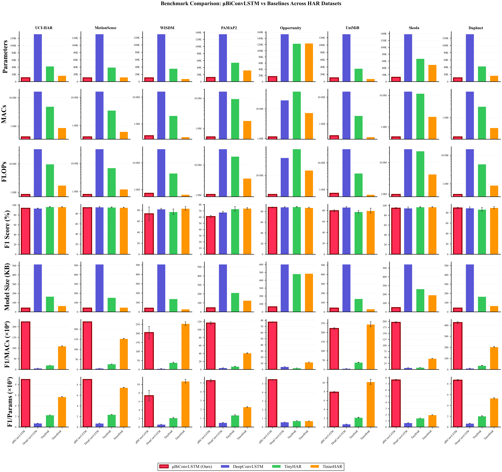
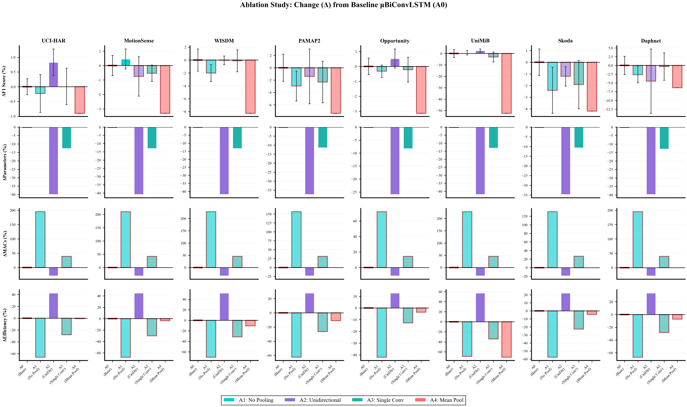
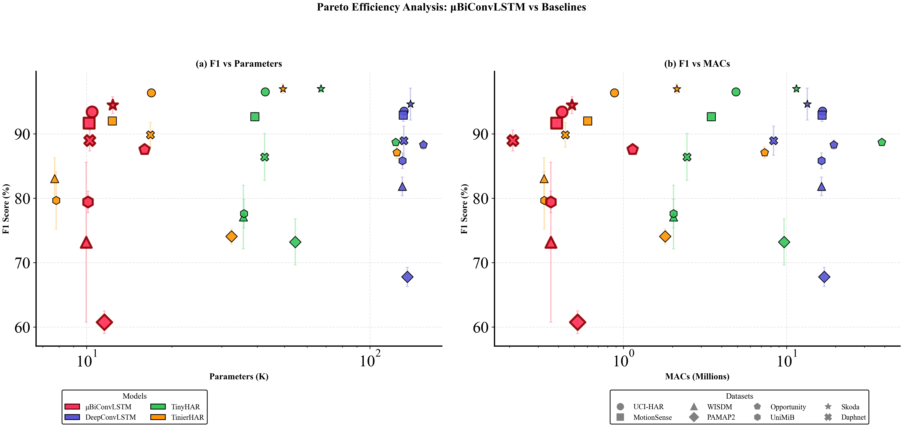
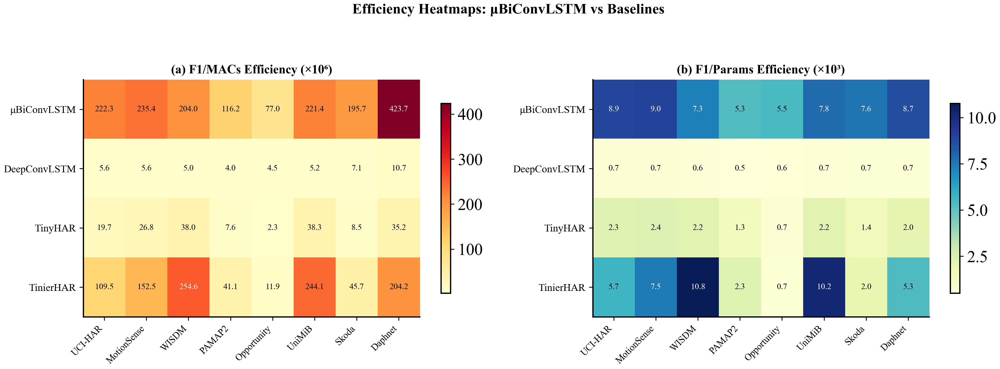
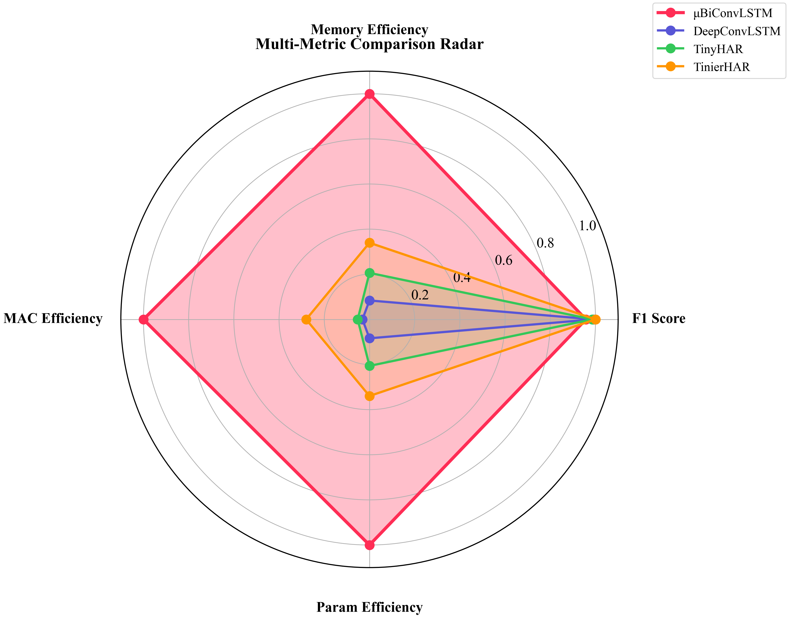
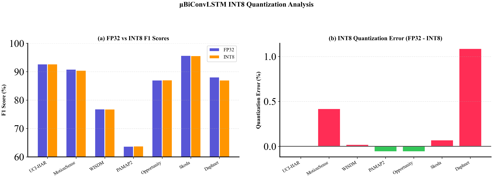
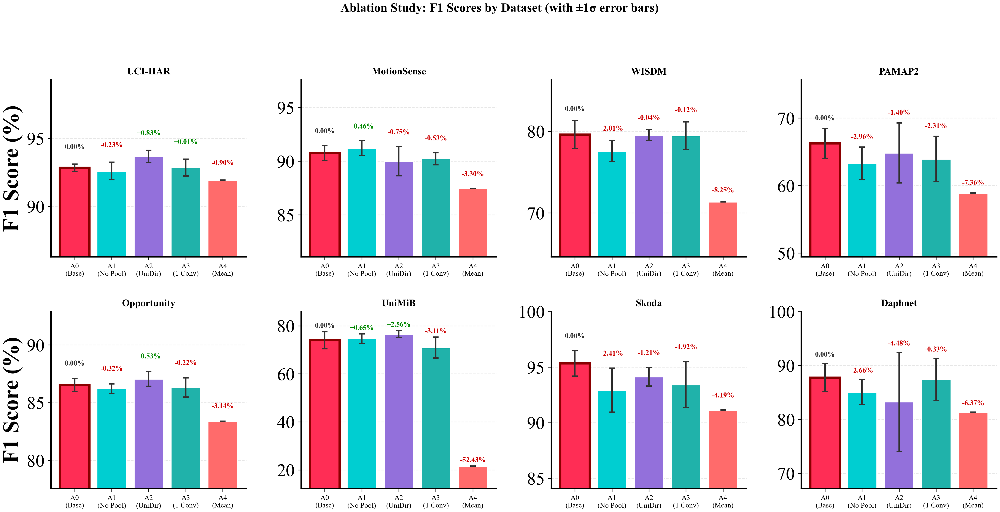

# MicroBiConvLSTM: An Ultra-Lightweight Bidirectional Convolutional LSTM for Human Activity Recognition.

**Author:** Mridankan Mandal

**Paper:** [MicroBiConvLSTM on arXiv](https://arxiv.org/abs/2602.06523)

---

## Overview.

MicroBiConvLSTM is an ultra-lightweight convolutional LSTM architecture designed for efficient Human Activity Recognition (HAR) on edge devices. The model achieves competitive recognition accuracy while using only approximately 10,500 parameters and maintaining O(N) inference complexity. It is designed for deployment on resource-constrained platforms such as microcontrollers, wearables, and mobile devices.

The architecture consists of a two-stage convolutional feature extractor followed by a single-layer bidirectional LSTM and a linear classification head. The convolutional stages apply temporal compression via max pooling, reducing the sequence length by 4x before the LSTM processes the features. This design allows the model to fit comfortably in as little as 21 KB of memory when quantized to INT8.

This repository contains the complete source code, baseline implementations, training scripts, hyperparameter optimization (HPO) pipelines, ablation study runners, and benchmark results presented in the research paper.



*Figure 1: The MicroBiConvLSTM architecture. Input sensor data passes through two Conv1D blocks with batch normalization, ReLU activation, and max pooling, followed by a bidirectional LSTM and a classification head. The total parameter count is approximately 10,454 for UCI-HAR (9 input channels, 6 classes).*

---

## Key Features.

- **Ultra-Lightweight:** Approximately 10,500 trainable parameters with a frozen architecture configuration.
- **Linear Complexity:** O(N) time complexity with respect to sequence length.
- **Bidirectional Context:** Full forward and backward temporal modeling through a bidirectional LSTM.
- **Temporal Compression:** Two stages of 2x max pooling reduce the LSTM input sequence by 4x.
- **Edge-Ready:** Fits in 21 KB (INT8) suitable for STM32, ESP32, and similar microcontrollers.
- **No Attention Required:** Pure convolutional and recurrent architecture without attention mechanisms.

---

## Architecture Summary.

| Property | Value |
|----------|-------|
| Architecture Family | Convolutional LSTM |
| Conv Layers | 2 |
| Conv Filters | 16 |
| Conv Kernel Size | 5 |
| LSTM Layers | 1 |
| LSTM Hidden Size | 24 |
| Bidirectional | Yes |
| Pooling | MaxPool(2) x 2 |
| Total Parameters (UCI-HAR) | 10,454 |
| Average MACs | Approximately 485K |

---

## Comparison with Baselines.

The following table summarizes the model sizes and average F1 scores across eight HAR benchmark datasets.

| Model | Parameters | FP32 Size | INT8 Size | Avg F1 (%) |
|-------|-----------|-----------|-----------|------------|
| **MicroBiConvLSTM** | **10.5K** | **42 KB** | **21 KB** | **83.68** |
| TinierHAR | 17K | 68 KB | 34 KB | 88.01 |
| TinyHAR | 42K | 169 KB | 85 KB | 86.88 |
| DeepConvLSTM | 132K | 529 KB | 264 KB | 86.72 |



*Figure 2: Benchmark comparison across eight HAR datasets. Each column represents a dataset and each row represents a different evaluation metric (parameters, MACs, FLOPs, F1 score, model size, efficiency ratios).*

---

## Benchmark Datasets.

The model is evaluated on eight publicly available HAR benchmark datasets.

| Dataset | Channels | Sequence Length | Classes | Description |
|---------|----------|----------------|---------|-------------|
| UCI-HAR | 9 | 128 | 6 | Smartphone accelerometer and gyroscope. |
| MotionSense | 6 | 128 | 6 | iPhone motion sensor data. |
| WISDM | 3 | 128 | 6 | Smartwatch accelerometer data. |
| PAMAP2 | 19 | 128 | 12 | Multi-IMU physical activity monitoring. |
| Opportunity | 79 | 128 | 5 | Body-worn sensor network for gesture recognition. |
| UniMiB-SHAR | 3 | 128 | 9 | Smartphone accelerometer ADL and falls. |
| Skoda | 30 | 98 | 11 | Car assembly line gesture recognition. |
| Daphnet | 9 | 64 | 2 | Freezing of gait detection for Parkinson's patients. |

---

## Ablation Studies.

Five architectural ablation variants are evaluated to demonstrate the contribution of each component.

| ID | Variant | Description |
|----|---------|-------------|
| A0 | Base Model (Frozen) | Full architecture with two Conv1D blocks, bidirectional LSTM, and last-timestep aggregation. |
| A1 | No MaxPool | Removes both max pooling layers. |
| A2 | Unidirectional | Switches to unidirectional LSTM. |
| A3 | Single Conv | Removes the second convolutional block. |
| A4 | Mean Pooling | Uses mean temporal aggregation instead of last timestep. |

Additional ablation studies include Pareto efficiency analysis, complexity scaling verification, INT8 quantization simulation, and robustness evaluations.



*Figure 3: Ablation study results showing F1 scores for each variant across all eight datasets.*



*Figure 4: Pareto efficiency frontier showing the trade-off between model parameters and F1 score across different configurations.*

---

## Efficiency Analysis.



*Figure 5: Efficiency heatmap comparing models across datasets. The heatmap visualizes the F1-per-parameter and F1-per-MAC ratios.*



*Figure 6: Radar chart comparing MicroBiConvLSTM against baselines across multiple dimensions including accuracy, parameters, MACs, and memory footprint.*



*Figure 7: INT8 quantization comparison showing model sizes and accuracy retention before and after dynamic quantization.*



*Figure 8: Absolute ablation results comparing each variant against the base model across all datasets.*

---

## Repository Structure.

```
Micro-Bi-ConvLSTM/
|-- README.md                    Main documentation.
|-- CodeBaseIndex.md             Complete codebase index.
|-- Usage.md                     Usage guide for training, HPO, and ablations.
|-- InstallationAndSetup.md      Installation and setup instructions.
|-- requirements.txt             Python dependencies.
|-- models/                      MicroBiConvLSTM model implementations.
|   |-- __init__.py
|   |-- light_deep_conv_lstm.py
|   |-- light_deep_conv_lstm_variants.py
|-- baselines/                   Baseline model implementations.
|   |-- __init__.py
|   |-- deepConvLstm.py
|   |-- tinyHar.py
|   |-- tinierHar.py
|-- data/                        Dataset loaders for all eight benchmarks.
|   |-- __init__.py
|   |-- uciHar.py
|   |-- motionSense.py
|   |-- wisdm.py
|   |-- pamap2.py
|   |-- opportunity.py
|   |-- unimib.py
|   |-- skoda.py
|   |-- daphnet.py
|-- scripts/                     Training, HPO, and analysis scripts.
|   |-- __init__.py
|   |-- trainLightDeepConvLSTM.py
|   |-- trainBaselines.py
|   |-- hpoLightDeepConvLSTM.py
|   |-- hpoBaselines.py
|   |-- ablationStudiesLightDeepConvLSTM.py
|   |-- benchmarkMemoryFootprint.py
|   |-- create_paper_figures.py
|   |-- visualize_sensor_waves.py
|-- results/                     Experiment results and benchmarks.
|   |-- TrainingResults.md
|   |-- HPOResults.md
|   |-- ablations/
|   |   |-- AblationsResults.md
|   |   |-- PublicationTables.md
|   |   |-- MemoryFootprintResults.md
|   |-- hpo/                     HPO result JSON files.
|   |-- training/                Training result JSON files.
|-- docs/                        Architecture documentation and figures.
|   |-- Architecture.md
|   |-- figures/                 Publication figures and diagrams.
```

---

## Quick Start.

1. Install dependencies.

```bash
pip install -r requirements.txt
```

2. Download the datasets into a `datasets/` folder (see [Usage.md](Usage.md) for details).

3. Train MicroBiConvLSTM on UCI-HAR.

```bash
python scripts/trainLightDeepConvLSTM.py --dataset ucihar --seeds 5
```

4. Train all baselines on UCI-HAR.

```bash
python scripts/trainBaselines.py --dataset ucihar --model all --seeds 5
```

5. Run hyperparameter optimization.

```bash
python scripts/hpoLightDeepConvLSTM.py --dataset ucihar --n-trials 50
```

6. Run ablation studies.

```bash
python scripts/ablationStudiesLightDeepConvLSTM.py --dataset ucihar --study arch --seeds 5
```

For detailed instructions, see [Usage.md](Usage.md) and [InstallationAndSetup.md](InstallationAndSetup.md).

---

## Citation.

If you use this code in your research, please cite the following paper.

```bibtex
@article{mandal2026microbiconvlstm,
  title={MicroBiConvLSTM: An Ultra-Lightweight Bidirectional Convolutional LSTM for Human Activity Recognition},
  author={Mandal, Mridankan},
  journal={arXiv preprint arXiv:2602.06523},
  year={2026}
}
```

---

## License.

This project is released for academic and research purposes. Please refer to the repository license file for terms of use.
