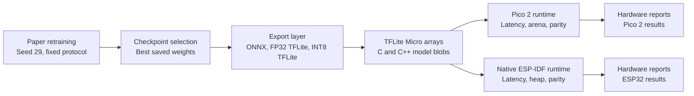

# Edge Deployment Guide:

## Purpose:

This repository now carries a complete edge deployment path for the paper configuration of MicroBiConvLSTM and the three baseline families, namely TinyHAR, TinierHAR, and DeepConvLSTM. The workflow was designed so that retraining, export, board preparation, and hardware benchmarking could be repeated from script entrypoints rather than from ad hoc notebook steps.

The deployment stack was organised in three layers. The first layer retrains the paper models with the fixed seed and hyperparameter settings used in the manuscript. The second layer converts the resulting checkpoints into ONNX, TFLite, and TFLite Micro compatible artifacts. The third layer prepares board-facing bundles for Raspberry Pi Pico 2 and native ESP-IDF based ESP32 execution.

## Workflow Overview:



## Repository Entry Points:

The main workflow was kept script-driven so that each stage could be called independently during experimentation or during reproducibility checks.

- `scripts/trainMicroBiConvLstm.py`.
- `scripts/trainBaselines.py`.
- `scripts/runPaperRetraining.py`.
- `scripts/exportEdgeModels.py`.
- `scripts/convertPaperRetraining.py`.
- `scripts/generatePicoFixture.py`.
- `scripts/runPico2DeploymentSweep.py`.
- `scripts/compilePico2VariantResults.py`.
- `scripts/prepareEsp32Bundle.py`.
- `scripts/runSingleEsp32Bundle.py`.
- `scripts/runEsp32NativeDeploymentSweep.py`.
- `scripts/compileEsp32ResultsReport.py`.

## Retraining Stage:

The retraining stage was aligned with the paper protocol. The seed was fixed to `29`, early stopping was retained, and the per-dataset hyperparameters were loaded from the repository HPO results. A full rerun may be launched with the following command.

```bash
python scripts/runPaperRetraining.py --models all --datasets all --seed-list 29 --epochs 200 --patience 10
```

The output of this stage is written under `results/paperRetraining/`, where the checkpoints, run configuration files, and seed-specific summaries are stored.

## Conversion Stage:

Checkpoint export was separated from retraining so that model conversion could be repeated without touching the training runs. A single checkpoint may be exported directly.

```bash
python scripts/exportEdgeModels.py --model microbi --dataset motionsense --checkpoint path/to/checkpoint.pt
```

A completed retraining bundle may also be converted in batch form.

```bash
python scripts/convertPaperRetraining.py --run-dir results/paperRetraining/<run_name>
```

During this stage, the quantized baseline path may now produce two internal quantized candidates when a severe collapse is detected. A full `INT8` export is still generated, but a mixed quantized candidate with `INT16` activations and `INT8` weights is also evaluated. When the mixed candidate materially improves parity, it is promoted to the canonical `*_quant.tflite` deployment artifact and the selection is recorded in `parity_report.json`.

Four user-facing artifact classes are therefore preserved in the repository.

- `*.onnx` for framework-neutral graph inspection.
- `*.tflite` for FP32 TensorFlow Lite validation.
- `*_quant.tflite` for the canonical quantized deployment artifact.
- `*_model.h` and `*_model.cpp` for TFLite Micro integration.

## Artifact Layout:

Three artifact trees are now committed for reproducibility.

- `models/convertedPaperModels/`.
  This directory stores the generic exported checkpoints and conversion outputs for the paper retraining sweep.
- `Pico2Models/`.
  This directory stores the Pico-facing TFLite Micro model arrays together with the Pico result JSON files.
- `Pico2Models/Results/pico2Fp32Int8Results.json`.
  This consolidated matrix is the canonical Pico 2 deployment record for the final repository state.
- `ESP32Models/`.
  This directory stores the ESP32-facing quantized deployment models together with the validated native ESP32 result JSON files and run logs.

The committed artifact layout was chosen so that the training code, the conversion code, and the board-ready assets could be inspected independently.

## Pico 2 Path:

The Pico 2 flow uses the Arduino-based runtime in `embedded/pico2EdgeRuntime/`. Model blobs and fixtures are prepared first, after which the deployment sweep may be launched.

```bash
python scripts/runPico2DeploymentSweep.py --models microbi --datasets all --port COM8
```

The Pico scripts expect the following tooling.

- `arduino-cli` on `PATH`, or the `ARDUINO_CLI` environment variable.
- `picotool` on `PATH`, or the `PICOTOOL` environment variable.
- A Python interpreter for UF2 helper tools through `PICO_TOOL_PYTHON`.
- Optional WSL bridge values through `WSL_DISTRO` and `WSL_DEPLOY_PYTHON`.

After the raw board runs have been collected, the consolidated `FP32` and `INT8` matrix may be regenerated from the committed summary JSON with the following command.

```bash
python scripts/compilePico2VariantResults.py
```

## Native ESP32 Path:

The ESP32 flow uses a native ESP-IDF project in `embedded/esp32NativeDeployment/`. The Arduino-core path was abandoned because a self-consistent native runtime was required for stable TFLite Micro behaviour on the connected classic ESP32 board.

```bash
python scripts/runEsp32NativeDeploymentSweep.py --models microbi --datasets all --port COM9
```

The ESP32 scripts expect the following tooling.

- `idf.py` to be reachable through the ESP-IDF export environment.
- `ESP_IDF_EXPORT_BAT` to point to the Windows ESP-IDF export script when the host bridge is used.
- `IDF_PYTHON_ENV_PATH` when an explicit ESP-IDF Python environment must be injected.
- Optional WSL fixture generation through `WSL_DISTRO` and `WSL_MAMBAHAR_PYTHON`.

## Generated Runtime Files:

The runtime projects still generate board-local files on demand during a build. These generated files are intentionally ignored in the runtime source trees so that the committed repository remains readable.

- `embedded/pico2EdgeRuntime/edge_model.*`.
- `embedded/pico2EdgeRuntime/edge_fixture.h`.
- `embedded/esp32NativeDeployment/main/edge_model_data.*`.
- `embedded/esp32NativeDeployment/main/edge_fixture.h`.
- `embedded/esp32NativeDeployment/main/edge_ops_config.h`.

## Recommended Reading Order:

If the repository is being approached for the first time, the following reading order is recommended.

1. Read [README.md](../README.md).
2. Read [Usage.md](../Usage.md).
3. Read [InstallationAndSetup.md](../InstallationAndSetup.md).
4. Inspect [Pico2DeploymentResultsReport.md](./Pico2DeploymentResultsReport.md).
5. Inspect [ESP32DeploymentResultsReport.md](./ESP32DeploymentResultsReport.md).

## Closing Note:

The deployment workflow was not added merely as a convenience layer. It was added so that the paper claims could be checked against concrete hardware artefacts, board-level logs, and reproducible export bundles. For that reason, the script entrypoints, committed model folders, and deployment reports should be interpreted as one integrated reproducibility package.
